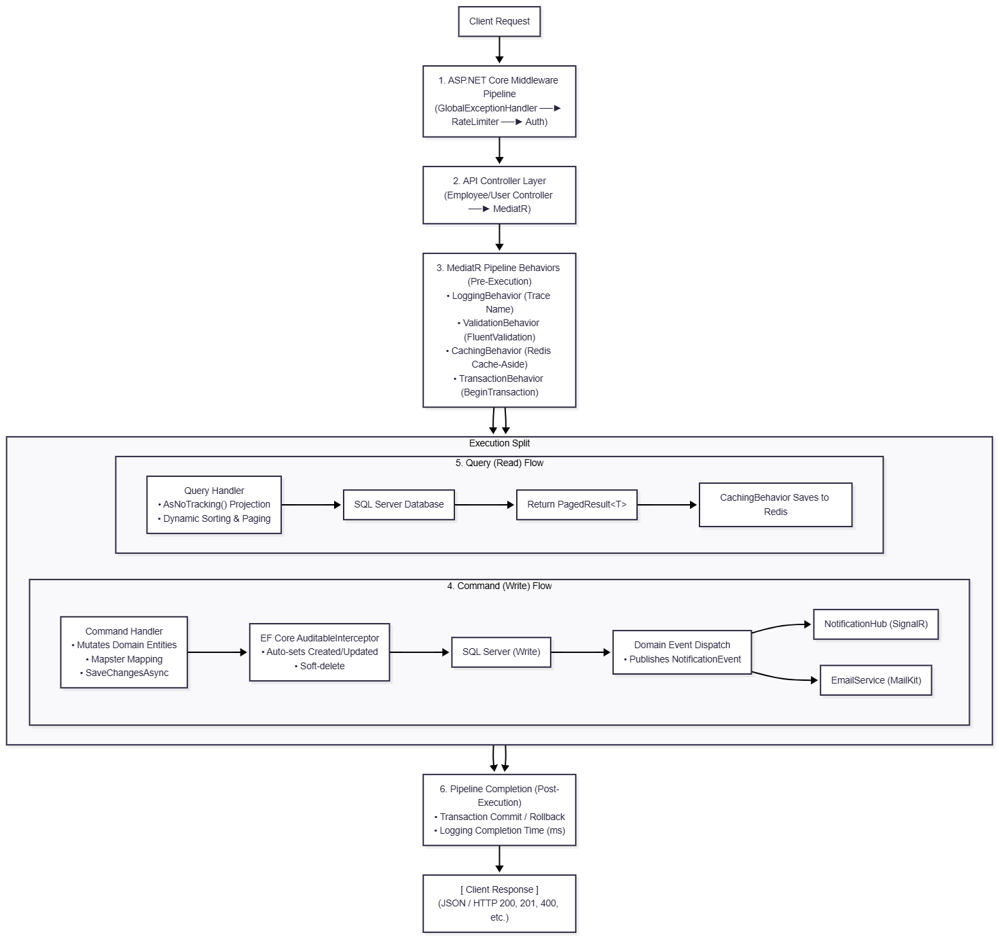

# 🍃 UvaTea Enterprise Platform - Server Application

[](https://dotnet.microsoft.com/)
[](https://learn.microsoft.com/en-us/ef/core/)
[](https://redis.io/)
[](https://github.com/jbogard/MediatR)
[](https://www.docker.com/)
[](tests/)

---

## 📌 1. Project Overview & Background

**UvaTea Enterprise Server Application** is a scalable, modular RESTful Web API designed to automate and manage end-to-end industrial tea manufacturing and plantation operations for **Uva Tea Factory (Sri Lanka)**.

Tea factories in Sri Lanka traditionally struggle with fragmented workflows—from harvest tracking across hilly estate divisions to batch tea production, distributor dispatching, and manual payroll tracking. This enterprise platform centralizes and modernizes these operations through a high-performance, event-driven backend architecture.

---

## 🛑 2. Problem Statement & The Solution

### ⚠️ The Challenges (Problems Identified)
1. **Inefficient Harvest & Plucking Tracking:** Inaccurate recording of daily tea plucking sessions across different estate divisions (Area), plucker productivity, and leaf grades (Leaftype).
2. **Resource & Fertilizer Mismanagement:** Lack of traceability in fertilizer inventory and distribution schedules across field allocations.
3. **Production Bottlenecks:** Difficulties monitoring tea leaf drying, rolling, oxidation, and processing stages against production batch orders.
4. **Manual B2B Distribution & Sales Tracking:** Delays in handling wholesale tea orders, credit limits, invoices, and distributor dispatches.
5. **Data Inconsistencies & Concurrency Hazards:** Risk of inconsistent financial/inventory states when simultaneous modifications occur without transactional atomicity.

### 💡 The Solution (UvaTea Enterprise System)
* **Digital Estate & Plantation Management:** Division-level area mapping with plant counts, acreage, and assigned field supervisors.
* **Harvest & Plucking Session Automation:** Records individual plucker yields per session and links directly to factory intake.
* **Batch Manufacturing & Processing (MRP):** End-to-end production tracking from raw green leaves to packaged tea grades with quality metrics.
* **Wholesale Distribution & Invoicing Engine:** Automated B2B order lifecycle, credit limit validation, and invoice generation.
* **Reliable CQRS & Transaction Handling:** MediatR-powered pipelines with type-safe Unit of Work (IUnitOfWork) guaranteeing ACID transactions, auditability, and soft deletions.

---

## 🗺️ 3. Functional Business Domains & Scope

Based on the domain entity modeling, the platform encompasses six core operational pillars:

| 1. Plantation & Harvesting | 2. Inventory & Agronomy | 3. Factory Manufacturing | 4. Commercial & Sales |
| :--- | :--- | :--- | :--- |
| • Field Areas<br>• Categories<br>• Supervisors<br>• Plucking Logs | • Fertilizer DB<br>• Stock & Brands<br>• Field Dispatches<br>• Usage Records | • Tea Grades<br>• Production Batches<br>• Order Status | • Distributor<br>• Orders<br>• Invoices<br>• Line Items |
| **5. Identity, Access Control & Workforce** | | | |
| \- Employee Directory<br>\- Field Assignments | \- Role-Based Access Control (RBAC)<br>\- Dynamic Operations & Permissions | \- JWT Auth | |
| **6. Cross-Cutting Enterprise Capabilities** | | | |
| \- Distributed Caching (Redis)<br>\- SMTP Notifications (MailKit) | \- Real-Time Push Alerts (SignalR)<br>\- Global Rate Limiting | | |

---

## 🏛️ 4. System Architecture & Request Lifecycle

The application adheres to **Clean Architecture** and **CQRS (Command Query Responsibility Segregation)** principles:


---

## 💻 5. Tech Stack & Dependencies

| Area | Technology / Library | Description |
| :--- | :--- | :--- |
| **Framework** | **.NET 10 (C# 13)** | High-performance ASP.NET Core runtime |
| **Persistence** | **Entity Framework Core 10** | ORM for SQL Server with Code-First configurations |
| **Architecture** | **MediatR 14.2** | Decoupled CQRS and Domain Event dispatching |
| **Caching** | **StackExchange.Redis** | Distributed cache-aside strategy for heavy read queries |
| **Validation** | **FluentValidation 12.1** | Business rule validation with database uniqueness checks |
| **Mapping** | **Mapster 10.0** | High-speed DTO-to-Entity object mapping |
| **Security** | **JWT Bearer (ASP.NET Core)** | Stateless token-based authentication & PBKDF2 hashing |
| **Real-Time** | **SignalR WebSockets** | Instant operational push alerts to client dashboards |
| **Mailing** | **MailKit & MimeKit** | Robust SMTP transactional email dispatcher |
| **Rate Limiting** | **Fixed-Window Limiter** | Prevents API flooding with 100 req/min thresholds |
| **Testing** | **xUnit, Moq, FluentAssertions** | Full unit testing with EF Core In-Memory provider |
| **Containerization** | **Docker** | Multi-stage release image build |

---

## 📂 6. Solution & Project Structure

```text
UvaTea/
├── UvaTea.slnx                                # Modern SLNX Solution File
├── Dockerfile                                 # Multi-stage production container manifest
│
├── UverTeaServerApp/                          # Main Web API Application
│   ├── Program.cs                             # Composition root, middleware pipeline, DI
│   ├── appsettings.json                       # Configuration (DB, Redis, JWT, SMTP)
│   │
│   ├── src/
│   │   ├── Feature/                           # Vertical Slice / Feature Modules
│   │   │   ├── EmployeeModule/                # Employee management, lookup, events
│   │   │   │   ├── Commands/                  # Create, Update, Delete Commands + Handlers
│   │   │   │   ├── Queries/                   # GetAll, Search Employees + Handlers
│   │   │   │   ├── Events/                    # Domain events & SignalR/Email dispatchers
│   │   │   │   ├── Models/                    # Entities, Configurations, DTOs
│   │   │   │   └── Services/                  # Business lookup services
│   │   │   └── UserModule/                    # RBAC User accounts & Credentials
│   │   │
│   │   └── Shared/                            # Cross-Cutting Core Components
│   │       ├── Behaviors/                     # Logging, Validation, Caching, Transactions
│   │       ├── Caching/                       # Redis ICacheService & ICacheableQuery
│   │       ├── Common/                        # PagedResult<T>, PaginationParams
│   │       ├── Data/                          # UvaTeaDbContext, UnitOfWork, Interceptors
│   │       ├── Entities/                      # IAuditableEntity, ISoftDeletable
│   │       ├── Extensions/                    # Server-side QueryableExtensions
│   │       ├── Hubs/                          # SignalR NotificationHub
│   │       ├── Middlewares/                   # GlobalExceptionHandler, Custom Exceptions
│   │       ├── Security/                      # JWT Token generation, AuthController
│   │       └── Services/                      # EmailService (MailKit)
│
└── tests/
    └── UverTeaServerApp.UnitTests/            # Comprehensive Unit Test Project
        ├── Behaviors/                         # Pipeline behavior unit tests
        ├── Common/                            # TestDbContextFactory, MockDataGenerator
        ├── Extensions/                        # Pagination/Sorting tests
        └── Features/                          # Command & Query handler tests
```

---

## ⚡ 7. Getting Started

### Prerequisites
* [.NET 10 SDK](https://dotnet.microsoft.com/download/dotnet/10.0)
* [SQL Server](https://www.microsoft.com/en-us/sql-server/) (or LocalDB / Azure SQL)
* [Redis](https://redis.io/) (Local instance or Docker container)

### ⚙️ Configuration
Update `UverTeaServerApp/appsettings.json` with your connection strings:

```json
{
  "ConnectionStrings": {
    "DefaultConnection": "Server=localhost;Database=UvaTeaFactory;Trusted_Connection=True;TrustServerCertificate=True;",
    "Redis": "localhost:6379"
  },
  "JwtSettings": {
    "Secret": "YourSuperSecretKeyWithSufficientLength32Chars!",
    "Issuer": "UvaTeaServerApp",
    "Audience": "UvaTeaClientApp",
    "DurationInMinutes": 60
  },
  "EmailSettings": {
    "Server": "smtp.gmail.com",
    "Port": 587,
    "SenderName": "Uva Tea Factory",
    "SenderEmail": "notifications@uvatea.lk",
    "Username": "your_email@gmail.com",
    "Password": "your_app_password"
  }
}
```

### 🏃 Running Locally
```bash
# 1. Restore dependencies
dotnet restore

# 2. Run Database Migrations
dotnet ef database update --project UverTeaServerApp

# 3. Start the API
dotnet run --project UverTeaServerApp
```
The API will be hosted at https://localhost:7001 or http://localhost:5000.
OpenAPI / Swagger documentation is available in development mode at `/openapi/v1.json`.

---

## 🧪 8. Testing

The solution includes a full suite of isolated unit tests covering CQRS handlers, pipeline behaviors, and database abstractions using EF Core In-Memory database:

```bash
# Run all unit tests
dotnet test
```

**Test Coverage Summary:**
* **Pipeline Behaviors:** Caching (Hit/Miss/Bypass), Transaction (Begin/Commit/Rollback), Validation.
* **Commands & Handlers:** Create, Update, Soft-Delete, Security, Password Hashing.
* **Queries:** Pagination, dynamic field sorting, keyword search filters.
* **Current Result:** 22 Passed, 0 Failed, 0 Skipped.

---

## 🐳 9. Docker Deployment

To build and run the containerized image:

```bash
# Build the Docker image
docker build -t uvatea-server:latest .

# Run container with environment bindings
docker run -d -p 8080:8080 --name uvatea-api uvatea-server:latest
```

---

## 📄 10. License
This project is proprietary software developed for **Uva Tea Factory**. All rights reserved.